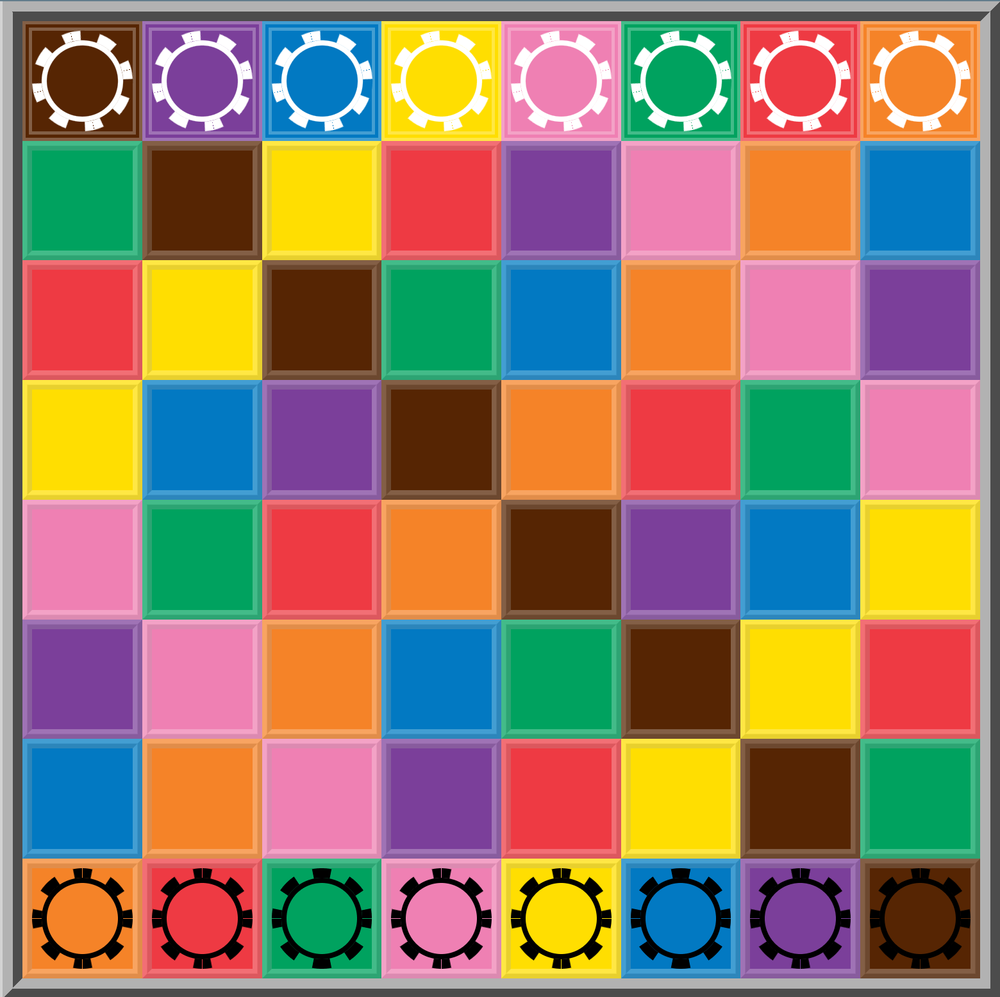

# Kamisado

A kamisado game using symfony-ux



## How to play
A playing board, divided into 64 squares in eight different colors.
There are 16 towers, per player they have a unique colour matching the 8 possible colours of the tiles.
The goal is to move your tower to the opposite side of the board, while blocking your opponent from doing the same.
White always starts the game.
The colour of the tower that moves next is determined by the colour of the tile the other player moves to.
If the player has no moves the move goes to the other player. This can be used strategically to make two moves in a row.
The game ends when one player has made it across the board.
Enjoy!

## Installation

```bash
$ composer install
$ npm install
$ npm build
```
